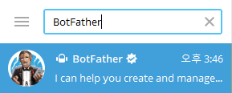
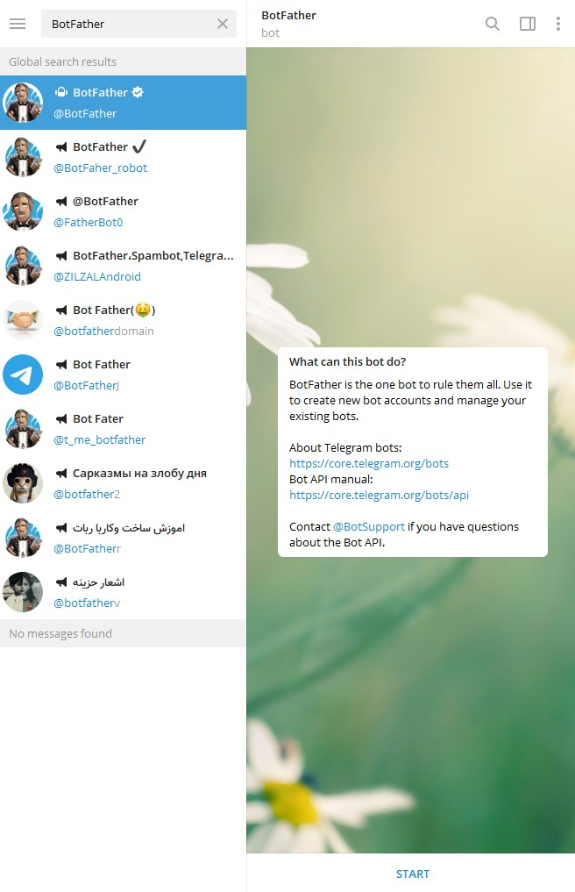
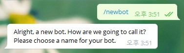
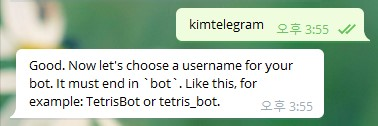
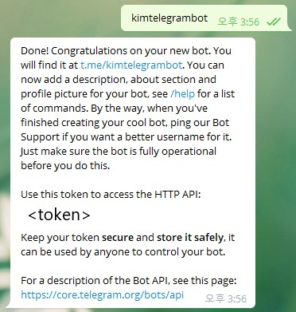
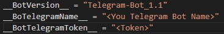
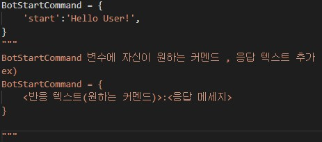

# TelegramBot

<br>

```bash
pip install python-telegram-bot
```

<br>

__Telegram 다운로드__

[Telegram Donwload Link](https://desktop.telegram.org/)

<br>

#### 1. 실행한 다음 BotFather봇을 친추한 다음



<br>

#### 2. @BotFather이라고 태그 되어있는 봇을 클릭한 후
하단 우측 START 버튼 클릭

<br>



<br>

#### 3. 채팅 창에 /newbot 입력



<br>

#### 4. 자신이 원하는 봇의 이름 입력



<br>

#### 5. 친추를 위한 봇 태그 입력



* __\<token\> 부분에 나오는것은 새로 생성된 봇의 토큰이다.__

<br><br>

* * *

<br>

### 해당 TelegramBot 파일 기본 설정

<br>

+ ##### Token , Telegram Bot Name



\<Token> =  새로 생성했던 봇의 토큰

\<You Telegram Bot Name> = 새로 생성했던 봇의 네임

+ ##### BotStartCommand Variable



BotStartComand = 텔레그램봇의 커멘드 추가용 변수

<br><br>

* * *

<br>

### 1. 텔레그램 봇 반응 커멘드 추가

<br>

텔레그램 봇이 /start 같은 커멘드에 반응하기 위해선
./Telegram_CommandList.py 파일의 BotStartCommand 변수를 추가하면 됩니다.

예시
```py
BotStartCommand = {
    'start':'Telegram Bot Start !',
    'help':'Hello User!'
}
```

__/start__ , __/help__ 커멘드를 추가한 다음 

```py
import BotStart

TelegramBot = BotStart.TelegramBot_Run()
TelegramBot.Cmd_Add()
TelegramBot.bot_start()
```

위 코드처럼 봇을 스타트시키면 __/start__ 과 __/help__ 명령어에 반응하게 됩니다.

* * *

<br>

### 2. 텔레그램 봇 반응시 함수 실행

<br>

텔레그램 봇을 실행하는 도중 특정 커맨드를 입력하면 함수를 실행시키기 위해

```py
import BotStart

TelegramBot = BotStart.TelegramBot_Run()

def test():
    return 'HelloWorld'

TelegramBot.FunctionCmd_Add('help', test)
#TelegramBot.FunctionCmd_Add(<원하는 반응 커멘드>, <실행시키고자 하는 함수 네임>)
TelegramBot.bot_start()
```

<br>

```py
import BotStart

TelegramBot = BotStart.TelegramBot_Run()

def test(a,b):
    return (a,b)

TelegramBot.FunctionCmd_Add('ab',test, args = (1,2))
TelegramBot.bot_start()
```

* * *

<br>

### 3. 텔레그램 봇 일정 시간마다 함수 실행

<br>

+ ___s(self, s, FunctionObject) -> None:__

    + (s)초마다 실행

    <br>

+ ___m(self, m , FunctionObject) -> None:__

    + (m)분마다 실행
    
    <br>

+ ___h(self, h, FunctionObject) -> None:__

    + (h)시간마다 일정하게 실행
    
    <br>

+ ___day(self, datetime, FunctionObject) -> None:__

    + 날마다 (datetime)시간대에 실행
    
    <br>

+ ___Runh(self,FunctionObject) -> None:__

    + 한시간마다 실행
    
    <br>

텔레그램 봇을 이용하여 24시간마다 hello 이라는 메세지를 전송하는 기능을 원한다면

```py
import BotStart

chat_id = "my telegram chat_id"

def MessageSend():
    global chat_id

    TelegramBot = _OneSendMsg()
    TelegramBot.Chat_idSend(chat_id, "hello")


a = BotStart.TimeStartBotSend()
a._day("00:00",MessageSend)
a.TimeStart()
```

이런식으로 _OneSendMsg 클래스를 이용하여 호출하는 함수를 만든 다음
TimeStartBotSned 클래스로 00:00시 마다 MessageSend 함수를 실행시킵니다.